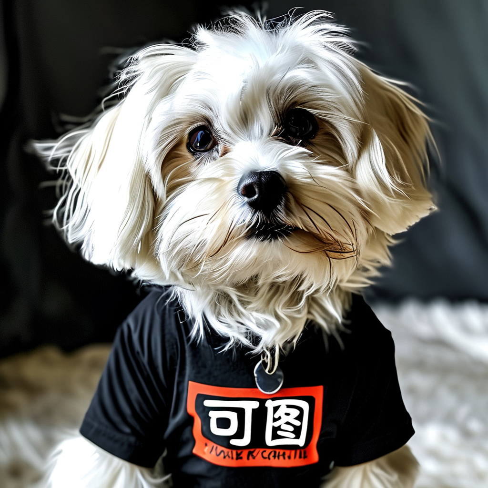
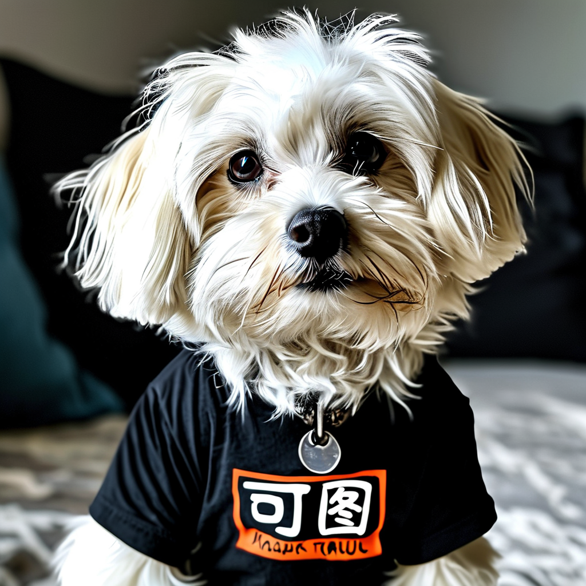
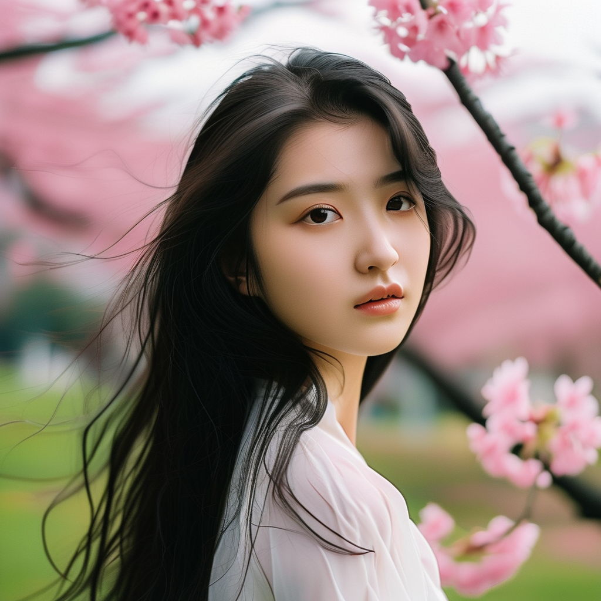
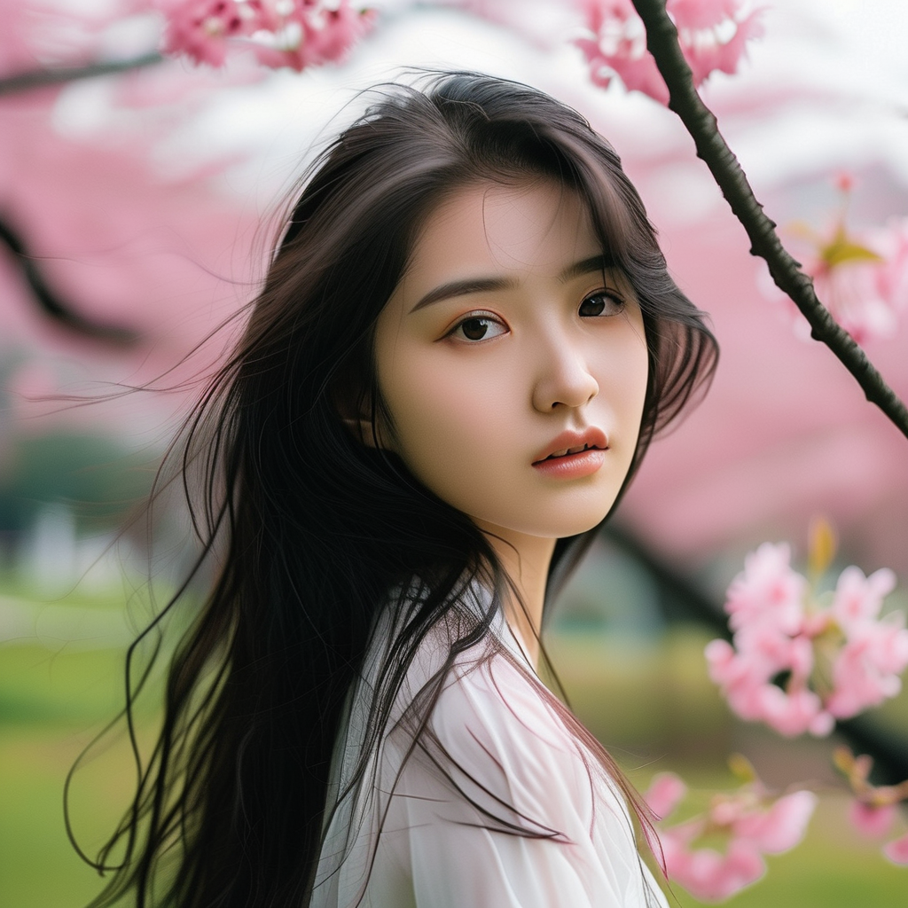

# Using onediff to accelerate the quality evaluation of kolors.

## Qualitative evaluation

We used several typical prompts to visualize generated images, proving that the compilation acceleration of onediff is almost lossless.

| Prompt | Reference Image (Original PyTorch) | OneFlow Backend | NexFort Backend |
|--------|-----------------|----------------|-----------------|
| 穿着黑色T恤的可爱小狗，T恤上面中文绿色大字写着“可图”。 |  |  |  |
| 一张兔子的特写照片，春天的森林中，有雾、晕影、开花、戏剧性的氛围，以三分法为中心，200mm 1.4f的微距镜头拍摄。 |  |  |  |
| 一条繁忙的街道，车辆在两个方向上行驶，街道上有几辆双层巴士和周围的人们。 |  |  |  |
| 动漫风格，一名女孩在室内，坐在客厅的沙发上，拥有粉红色的头发、白色的袜子、蓝色的眼睛，从背后、从上方看，面向观众，正在玩视频游戏，手持控制器，穿着黑色丝绸，嘴唇微张。 |  |  |  |
| 一张年轻中国女性在公园的肖像照片。她的长黑发轻轻飘动。背景中柔和的樱花粉增添了画面的美感。 |  |  |  |

## Quantitative evaluation

We calculated the Frechet Inception Distance (FID), Inception Score (IS), CLIP Score, and [Aesthetic Score](https://github.com/christophschuhmann/improved-aesthetic-predictor) based on the [coco-30-val-2014](https://huggingface.co/datasets/sayakpaul/coco-30-val-2014) dataset.

The Human [Preference Score v2 (HPS v2)](https://github.com/tgxs002/HPSv2) was evaluated on the Human Preference Dataset v2 (HPD v2) dataset.

These metrics demonstrate that the acceleration by onediff does not result in quality loss.

In addition, compared with the images generated by the original PyTorch HF diffusers baseline, we calculated the average Structural Similarity (SSIM) to demonstrate that the structure of the images generated after acceleration by onediff does not undergo significant changes.

| Metric            | Reference Value (Original PyTorch) | OneFlow Backend | NexFort Backend |
|-------------------|------------------------------------|-----------------|-----------------|
| FID ⬇️              | 25.022                             | 24.924          | 24.904          |
| IS ⬆️               | 37.472 ± 0.474                     | 37.575 ± 0.559  | 37.415 ± 0.723  |
| CLIP Score ⬆️       | 0.305                              | 0.305           | 0.305           |
| Aesthetic Score ⬆️  | 6.098                              | 6.097           | 6.100           |
| HPS v2 ⬆️           | 31.47                              | 31.47           | 31.58           |
| SSIM ⬆️             | -                                  | 0.858           | 0.810           |
