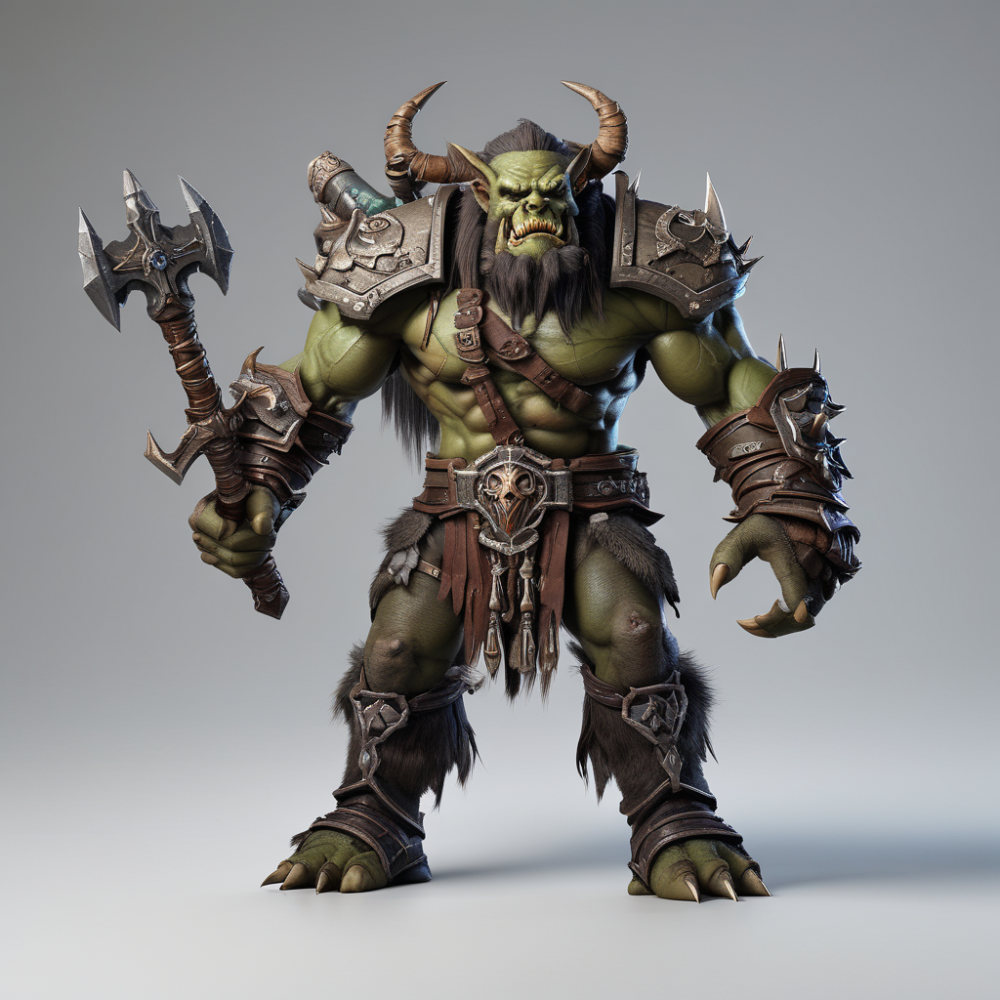
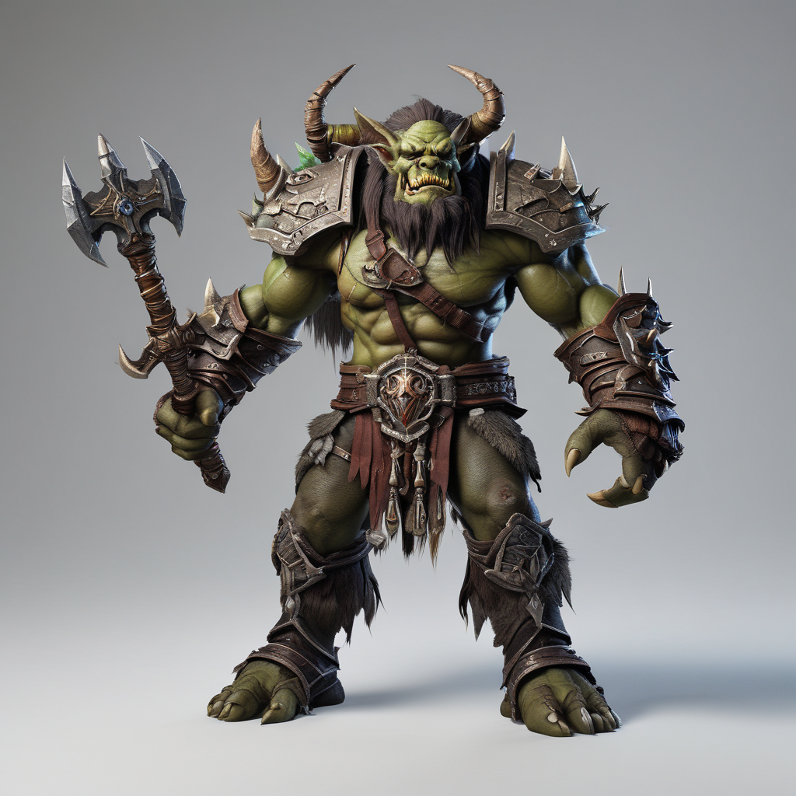
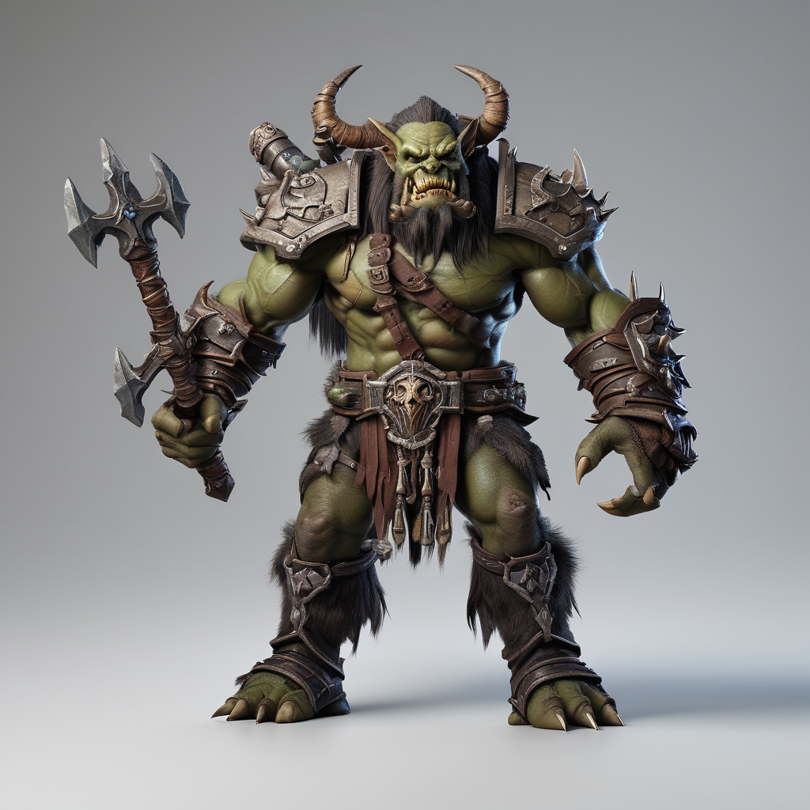

# Using onediff to accelerate the quality evaluation of SDXL-Lightning.

### Prompt
"product photography, world of warcraft orc warrior, white background"

### Results
|               | Image |
|------------------------|-------|
| **PyTorch**            |  |
| **OneFlow Compile**    |  |
| **OneFlow Quantization**|  |
| **NexFort Compile**    |  |
| **NexFort Quantization**|  |
